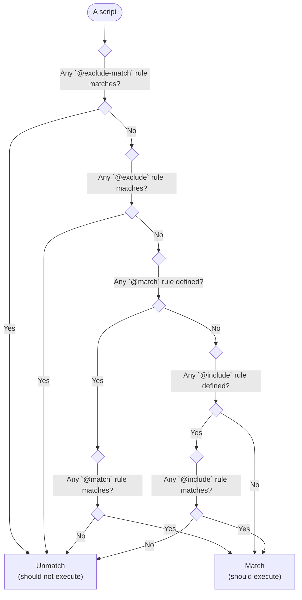

There are four types of rules: `@match` / `@exclude-match` / `@include` / `@exclude` in Violentmonkey.

@match / @exclude-match
---

It is recommended to use `@match` / `@exclude-match` rather than `@include` / `@exclude` because the *match* rules are safer and more strict.

`@match` defines a URL matching rule. `@exclude-match` defines a match rule but used to exclude the matched URLs, similar to `@exclude`.

For more details, see [Match Patterns](https://developer.chrome.com/extensions/match_patterns) for Chrome extensions.

Note that match patterns only work on scheme, host and path, i.e. match patterns always ignore query string and hash.

Since Violentmonkey v2.10.4, some additional rules are accepted:

- the scheme part accepts `http*` to match `http` or `https`;
- the host part accepts wildcards (`*`) at any position, e.g. `www.google.*`;
- the host part accepts `.tld` to match any top level domain suffix.

Examples:

```js
// @match *://*/*
// @exclude-match *://*.tk/*
```

@include / @exclude
---

Each `@include` and `@exclude` rule can be one of the following:

- a normal string

  If the string does not start or end with a slash (`/`), it will be used as a normal string.

  If there are wildcards (`*`), each of them matches any characters.

  e.g. `https://www.google.com/*` matches the following:
  - `https://www.google.com/`
  - `https://www.google.com/any/subview`

  but not the following:
  - `http://www.google.com/`
  - `https://www.google.com.hk/`

  If there is no wildcard in the string, the rule matches the entire URL.

  e.g. `https://www.google.com/` matches only `https://www.google.com/` but not `https://www.google.com/any/subview`.

  The host part accepts `.tld` to match top level domain suffix.

  e.g. `https://www.google.tld/` matches both `https://www.google.com/` and `https://www.google.co.jp/`.

- a regular expression

  If the string starts and ends with a slash (`/`), it will be compiled as a regular expression.

  e.g. `/\.google\.com[\.\/]/` matches the following:
  - `https://www.google.com/`,
  - `https://www.google.com/any/subview`
  - `http://www.google.com/`
  - `https://www.google.com.hk/`

Examples:

```js
// @include *
// @include https://www.google.com/*
// @include /\.com\.hk\//
// @exclude https://www.google.com/exact/url
```

How does a script match?
---

In short, a script will execute if it matches any `@match` or `@include` rule and does not match any `@exclude-match` or `@exclude` rule.

Here is the long version:

- If any `@exclude-match` or `@exclude` rule matches, the script does not match.
- Otherwise if any `@match` rule is defined, the script matches only if some of the `@match` rules match.
- If no `@match` rule is defined, we fallback to `@include` rules and the script matches only if some of the `@include` rules match.
- If neither `@match` nor `@include` rule is defined, the script is assumed to match.



Matching SPA sites like fb, github, twitter, youtube
---

Userscript extensions use the native behavior of the browser - it runs scripts defined by extensions only during the standard "hard" navigation, not during "soft" navigation via history.pushState or replaceState or #hash changes used by many modern [SPA sites](https://en.wikipedia.org/wiki/Single-page_application).

You can verify the type by opening devtools network log, then navigate in this tab (e.g. click a link) and look at the type of the request for this navigation: a `Document` (Chrome) or `HTML` (Firefox) means "hard" navigation i.e. the browser creates a new environment for the page and loads its HTML from the server including its scripts and userscripts from extensions.

**1. Run your userscript on the entire SPA site:**
```js
// @match *://www.youtube.com/*
```
**2. Then watch for changes** either using [vm-url](https://github.com/violentmonkey/vm-url) or manually:

```js
onUrlChange();

if (self.navigation) {
  navigation.addEventListener('navigatesuccess', onUrlChange);
} else {
  let u = location.href;
  new MutationObserver(() => u !== (u = location.href) && onUrlChange())
    .observe(document, {subtree: true, childList: true});
}

function onUrlChange() {
  if (!location.pathname.startsWith('/watch')) {
    // deactivate();
    return;
  }
  console.log('processing', location.href);
  // activate();
}
```
