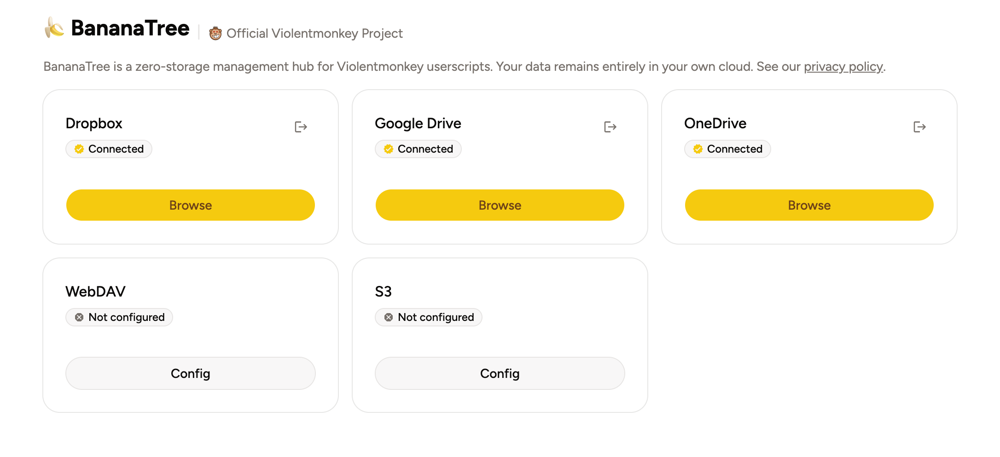

The banana tree produces bananas, and the monkey takes them. That's the idea behind [BananaTree](https://vm.bananatree.dev) — a management hub for [Violentmonkey](https://violentmonkey.github.io/) that lets you browse, view, and download your userscripts stored in the cloud.

## The problem

Violentmonkey can sync your scripts to cloud storage like Dropbox, Google Drive, or OneDrive. But once they're up there, there's no easy way to see what you have.

Google Drive, for example, doesn't let you browse the app directory where Violentmonkey stores its files. And Violentmonkey saves each script along with its metadata in a JSON file — not human-readable, not easy to extract individual scripts from.

You're left wondering: *What scripts do I have up there? Can I grab just one?*

## How BananaTree helps

BananaTree shares the same file parsing logic as Violentmonkey, so it can read the synced files and display their contents properly in a clean UI.

**Supported providers:**
- Dropbox
- Google Drive
- OneDrive
- WebDAV
- S3-compatible storage

**File browser** — Search by name, paginate large directories. No more guessing what's in there.

**Code viewer** — Built on the Monaco editor (the same engine powering VS Code), with syntax highlighting and dark/light theme support. Click a file and read it instantly.

**Userscript support** — Violentmonkey stores scripts as JSON with embedded metadata. BananaTree parses that format and presents the code and metadata in separate tabs, so you can see both clearly.

**Bulk download** — Need all your scripts? Download them as a single tar archive with one click. Need just one? Grab it individually.

**In-memory caching** — File lists and content are cached until you reload the page, so browsing is fast.

## Privacy first

BananaTree stores zero data on its servers. All operations are client-side. Credentials are transmitted only for the request they're needed for and discarded immediately after. Configuration (OAuth tokens, server URLs) stays in your browser's `localStorage`.

## Try it

No sign-up, no account creation. Just head to **[vm.bananatree.dev](https://vm.bananatree.dev)**, pick your cloud provider, authorize, and you're in.

The banana tree is ready. The monkey can come and take what it needs.
