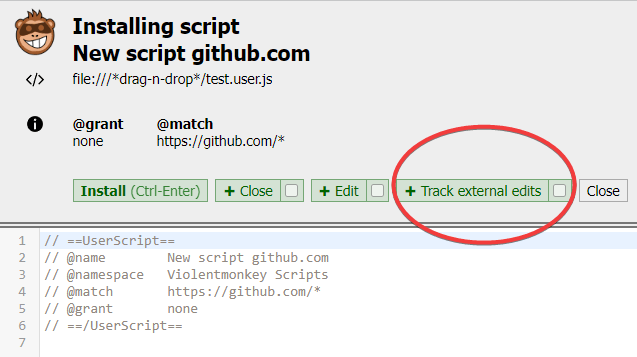
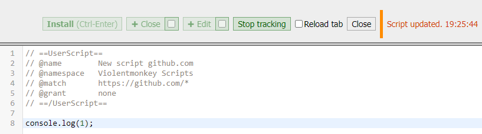

Since Violentmonkey is lightweight by design with a simple built-in editor featuring just a few customizations in the extension's options, we encourage you to use an external editor or IDE that's not restricted by browser quirks like the hardcoded hotkeys or performance limitations.

⚡ Simply open the local `.user.js` file in Violentmonkey and enable tracking, so each time you save the file in your external editor the changes are automatically incorporated.

Now let's dive into the details.

## 1. One-time preparation

1. Copy the code of the script from Violentmonkey into your editor.
2. Save it to a file and give it a name ending with `.user.js`

## 2. Open `.user.js` file in Violentmonkey installer

#### 2.1. Drag `.user.js` file into any Violentmonkey UI page [Chrome only]

* Chrome [86 or newer](https://caniuse.com/mdn-api_datatransferitem_getasfilesystemhandle), Violentmonkey 2.16 or newer. This is the most performant method since Chrome 133 that implemented `FileSystemObserver` API to notify of file changes.

* If you assign a hotkey to activate Violentmonkey in the browser's options for extensions, you can press it *while dragging the file*.

#### 2.2. Drag `.user.js` file into the browser toolbar or tab label area

  * In Chrome-like browsers you must enable *"Allow access to file URLs"* in Violentmonkey's details in `chrome://extensions` page first. Since this is dangerous (any userscript will be able to read any local file via GM_xmlhttpRequest), you may want to use the other methods instead.

  * In modern Firefox-like browsers don't close the tab of this file while tracking as it's used to read the contents of the file.

#### 2.3. Set up a server and navigate to `http://localhost:8080/my-script.user.js`

  The port number `:8080` may be different or even omitted depending on the server you installed.

  A good server is [indexzero/http-server](https://github.com/indexzero/http-server#readme). Once you install it, just type `http-server -c5` at the directory of your script to start a server. The `-c5` option sets cache time for max-age header to 5 seconds ([more info](https://github.com/violentmonkey/violentmonkey/issues/460#issuecomment-434335758)), thus forcing a browser to query the server URL every 5 seconds. The caching can be disabled with `-c-1` option.

  If you want a UI, there are such servers as well, e.g. `HTTP File Server` for Windows.

  ⚠ Make sure the hostname is `localhost` and the script name ends with `.user.js`.

## 3. Enable tracking

Click `Track external edits` button to confirm installation and start tracking.

You can also make it the default button for local files by ticking the checkbox on the right, so it can be invoked via the hotkey shown in parentheses.

## 4. Edit the local file and save it

As long as the installer tab is open it will track your local file and install the new version automatically into Violentmonkey after you save the file. You can save it either manually or by configuring auto-save in the options of your editor.

* The `Stop tracking` button may be useful for example when temporarily switching branches in your git repo. When finished, you can click `Track external edits` again.

* The `Reload tab` option will automatically reload the active tab if it contains a website [matched](/api/matching/) by this script when changes are detected.

Known issues
---

- Firefox may throttle detection: the older the file is, the longer it takes to detect the changes. See [this report](https://github.com/violentmonkey/violentmonkey/issues/460#issuecomment-434335758).
